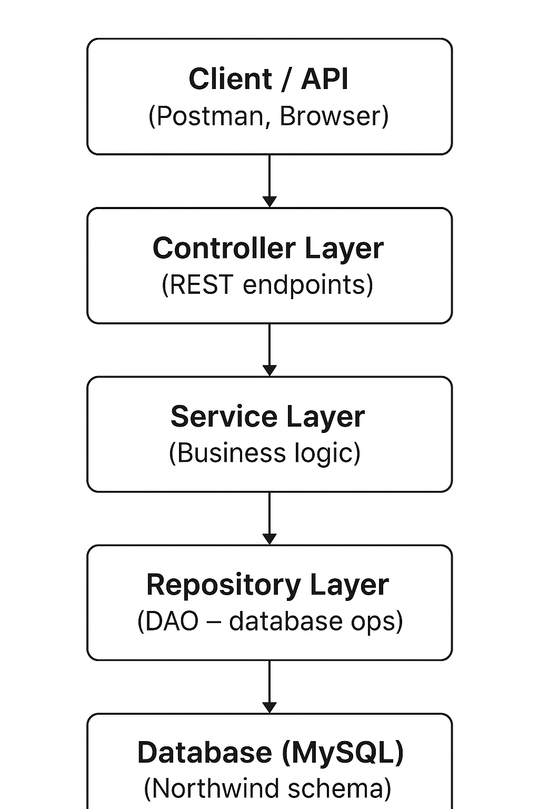

# Java Springboot API - Northwind application

## SPRINGBOOT --> 
- Production ready applications. 
- Built on spring. 
- JPA --> specs on how to speak to database. 


# How it works:



1. Controller (REST API endpoints)
   - Accepts HTTP requests (GET /customers, POST /customers, etc.)
   - Talks to the Service layer
   - Returns JSON responses

2. Service Layer (Business Logic)
   - Decides what needs to happen with the data
   - Calls the Repository layer to fetch/save data
   - Adds extra rules (e.g., validation, calculations, filtering)

3. Repository Layer (Data Access Objects - DAO)
   - Handles direct communication with the database
   - Powered by Spring Data JPA (JpaRepository)
   - Knows how to perform CRUD automatically

4. Database (MySQL - Northwind)
   - Stores data (customers, orders, products, etc.)
   - JPA maps Entities ↔ Tables


# LAB

1. Install the intelliJ Ultimate version --> 
   - Create JetBrains account - apply the code given to buy intelliJ ultimate. 
   - Install from download link. 

2. Install mySQL --> make sure to select all fields when installing (backend and workbench). Set username as root and password as password. 

3. In MySQL, add new connection --> local host. 
   - Install SQL script file given. 
   - Open the SQL script file in the local host connection (file --> open SQL script )

4. In intelliJ Ultimate -->
   - Install github link. Download as zip and unzip it. (This is the northwind application code). 
   - Open it in intelliJ. 
   - Right click on pom.xml --> change it to maven. 
   - Right click on it again and sync. 

5. Sync to database --> In intelliJ
   - On the right of intelliJ, database icon. Add MySQL database. Put in username and password and name of database (northwind).
   - In `application.properties` file --> change password to your db password. 

## If not using github link --> from scratch:
1. Create new project in intelliJ:

.png>)
   - Generator springboot. 

   - Create. 
2. Open pom.xml file and add dependencies:

```
<!-- Spring Boot Starter for Web --> 
<dependency>
<groupId>org.springframework.boot</groupId>
<artifactId>spring-boot-starter-web</artifactId>
</dependency>
 
<!-- Spring Boot Starter for Data JPA -->
<dependency>
<groupId>org.springframework.boot</groupId>
<artifactId>spring-boot-starter-data-jpa</artifactId>
</dependency>
 
<!-- Spring Boot Starter for Validation -->
<dependency>
<groupId>org.springframework.boot</groupId>
<artifactId>spring-boot-starter-validation</artifactId>
</dependency>
 
<!-- Spring Boot Starter for Actuator -->
<dependency>
<groupId>org.springframework.boot</groupId>
<artifactId>spring-boot-starter-actuator</artifactId>
</dependency>
 
<!-- MySQL Connector for Database Access -->
<dependency>
<groupId>com.mysql</groupId>
<artifactId>mysql-connector-j</artifactId>
<scope>runtime</scope>
</dependency>
 
<!-- Spring Boot Starter for Rest Repositories -->
<dependency>
<groupId>org.springframework.boot</groupId>
<artifactId>spring-boot-starter-data-rest</artifactId>
</dependency>
 
<!-- Spring Boot Starter for Testing -->
<dependency>
<groupId>org.springframework.boot</groupId>
<artifactId>spring-boot-starter-test</artifactId>
<scope>test</scope>
</dependency>
 

```
3. Connect to database:
   - On right hand side click database icon in intelliJ. 
   - Add new --> data source --> mySQL. 
   - Add the username and password (root, password). 
   - Install any missing drivers as prompted. 

4. To query database:
   - In the database section, click northwind --> tables --> customers -- left click customers and click new. Then create new query console. 

5. In `application properties` file in resources:
   - db connection information:

```
spring.application.name=Northwind
spring.datasource.url=jdbc:mysql://localhost:3306/northwind
spring.datasource.username=root
spring.datasource.password=password
server.port=8091

```

6. Plugins
   - Make sure all plugins are updated. 
   - Install JPA Buddy plugin. 


7. Entities

- Create new package in com.sparta.northwind --> name it `entities`. 

- Create entities --> java objects that persist things back to the database. 
- right click on the enitites package. 
- new --> `JPA entities from db`.
- Search for `customer` in the left bar. 
- Select customers. 
- The fields corrospond to the column names. 
- create.
- Once created, it should create a customers file with the different fields. 


8. In Customer.java:

- right click anywhere in customer.java and should add 4 fields.

```

    @Override
    public String toString() {
        return "Customer{" +
                "customerID='" + customerID + '\'' +
                ", companyName='" + companyName + '\'' +
                ", contactName='" + contactName + '\'' +
                ", contactTitle='" + contactTitle + '\'' +
                '}';
    }

```

9. Repositorites
- Right click com.sparta.
- New package --> repositories
- new interface called CustomerRepository.
- Interfaces are methods that can be implemented by other classes.


```
package com.sparta.northwind.repository;

import com.sparta.northwind.entities.Customer;
import org.springframework.data.jpa.repository.JpaRepository;

public interface CustomerRepository  extends JpaRepository<Customer, Integer> {
}


```
- Since an interface needs a concrete implementation, that object/implementation is automatically added. Called a bean. 
- it's stored as a bean that is only available at runtime.
- Springboot creates the bean object automatically and we dont control the creation or deletion of that. 


10.  In NorthwindApplication

- Entry point for the application. 
- Where we retrieve the concrete customerrepository bean. (it's stored as a bean that is only available at runtime).

```
package com.sparta.northwind;

import com.sparta.northwind.entities.Customer;
import com.sparta.northwind.repository.CustomerRepository;
import org.springframework.boot.SpringApplication;
import org.springframework.boot.autoconfigure.SpringBootApplication;
import org.springframework.context.ApplicationContext;

import java.util.List;

@SpringBootApplication
public class NorthwindApplication {

    public static void main(String[] args) {

        ApplicationContext context = SpringApplication.run(NorthwindApplication.class, args);

        CustomerRepository customerRepository = context.getBean(CustomerRepository.class);

        List<Customer> customers = customerRepository.findAll();

        for(Customer customer : customers){
            System.out.println(customer);
        }
    }

}


```
- Might get  error --> naming conventions :
`spring.jpa.hibernate.naming.physical-strategy=org.hibernate.boot.model.naming.PhysicalNamingStrategyStandardImpl` Add this to the application.properties file. 

--> should be working --> that calls the database. Should be able to see database. 

################# WHERE WE GOT TO ON FRIDAY

## Next step
- Multi-tiered application. 
- Services layer --> business logic. 

1. Create a new package called  `services`. 
2. Create a new java class within that package called `CustomerService`

### Adding delete and update methods in service and repository layer

- In the customerservice file:

```java
     // Delete method:
    public void deleteCustomerById(String id){
        if(customerRepository.existsById(id)){
            customerRepository.deleteById((id));
        }else {
            throw new IllegalArgumentException("Can't delete Customer with ID " + id);
        }
    }

    // Update method:
    public Customer updateCustomer(Customer customer) {
        return customerRepository.save(customer);
    }
```

## Controller

Add this dependency to pom.xml:

```
<dependency>
<groupId>org.springframework.boot</groupId>
<artifactId>spring-boot-starter-data-rest</artifactId>
</dependency>
```

- Create new package --> controllers.
- Create new java class --> CustomerController.

`@RepositoryRestResource(exported = false)` --> add this line into the customerrepository file.
Disables auto endpoint generation for our repository.

## ACCESSING THE API 

- url for api : `http://localhost:8091/swagger-ui/index.html`
- This website is pre-setup, we didnt do anything to set it up just added dependency. 
- Have to run the application (main file) to see the local host online. 

`DROP DATABASE northwind;`
 

## UNIT TESTING --> MOKITO 

- Test doubles -- simulate the real scenarios in testing environment (test mocks behaviour of the real methods).
- 